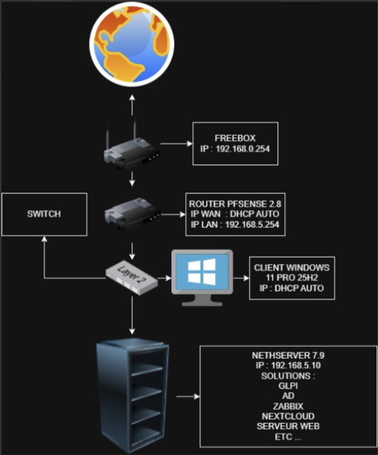

#Topology du projet 

Énoncé du projet

Dans ce projet, j’ai mis en place une infrastructure réseau et système complète destinée à un environnement de test.

J’ai réalisé :

la conception de l’architecture réseau,

le déploiement d’un serveur sous NethServer,

la configuration d’un routeur pfSense,

l’installation d’un poste client Windows virtuel,

l’administration du serveur à distance via SSH (PuTTY),

la mise en place de services réseaux et systèmes (Active Directory, MariaDB, GLPI, Nextcloud, Zabbix).

L’ensemble de l’infrastructure est fonctionnel, sécurisé et administrable, conformément aux besoins d’un environnement professionnel.

Compétences travaillées

(Référentiel BTS SIO – Option SISR)

Administrer les réseaux et les systèmes

Installer et configurer un serveur Linux (NethServer 7.9)

Mettre en place un routeur pare-feu pfSense (WAN, LAN, DHCP)

Définir et appliquer un plan d’adressage IP

Assurer la connectivité réseau et l’accès Internet

Tester et valider le bon fonctionnement du réseau

Exploiter, dépanner et superviser une infrastructure

Administrer un serveur à distance via SSH

Installer et gérer des services systèmes et applicatifs

Mettre en place une solution de supervision (Zabbix)

Identifier et corriger des dysfonctionnements réseau ou système

Vérifier l’état et la disponibilité des services

Gérer les services d’infrastructure

Installer et configurer un contrôleur de domaine Active Directory

Gérer les utilisateurs et les droits

Installer et sécuriser un serveur de base de données MariaDB

Déployer des services métiers :

GLPI

Nextcloud

Serveur Web

Sécuriser une infrastructure informatique

Configurer des règles de pare-feu adaptées

Limiter les ports ouverts aux services nécessaires

Sécuriser les accès administrateur

Appliquer les bonnes pratiques de sécurité système

Virtualiser et déployer des environnements

Créer et configurer des machines virtuelles

Gérer les interfaces réseau virtuelles

Déployer une infrastructure multi-machines cohérente

Adapter les ressources système aux besoins

Produire une documentation technique

Rédiger une documentation technique structurée

Décrire des procédures reproductibles

Formaliser une architecture réseau et système

Présenter un projet de manière claire et professionnelle