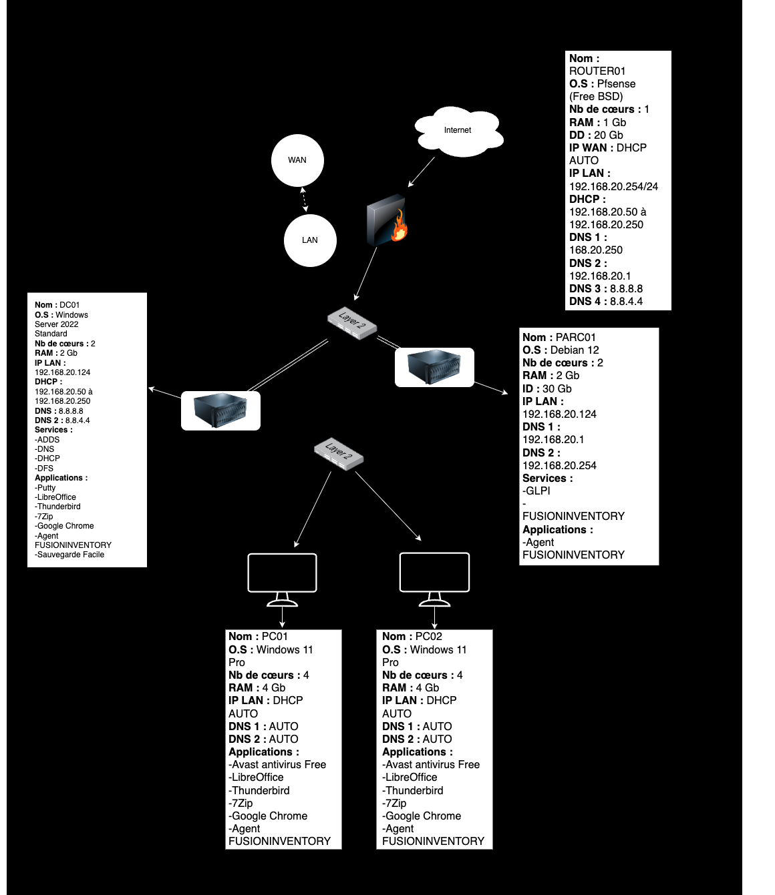

# Infrastructure SI – Environnement d’entreprise virtualisé

## Objectif du projet
Ce projet a pour objectif de concevoir, déployer et sécuriser une infrastructure de système d’information complète dans un contexte d’entreprise.  
Il s’appuie sur un environnement virtualisé et met en œuvre des services réseau, systèmes et applicatifs essentiels, ainsi qu’un domaine Active Directory permettant la gestion centralisée des utilisateurs et des ressources.

---

## Architecture de l’infrastructure
L’infrastructure repose sur un environnement virtualisé sous VMware intégrant :

- un pare-feu et routeur pfSense assurant la séparation WAN / LAN, le routage, le filtrage et le service DHCP
- un contrôleur de domaine Windows Server 2022
- des postes clients Windows 11 intégrés au domaine
- des services réseau et applicatifs internes

Schéma de l’infrastructure :

Un plan d’adressage IP cohérent est mis en place sur le réseau 192.168.20.0/24.

---

## Mise en œuvre technique

### Infrastructure réseau et sécurité
L’infrastructure réseau est sécurisée par un pare-feu pfSense configuré pour assurer :
- la séparation des flux WAN et LAN
- le routage entre les réseaux
- le filtrage des communications
- la distribution automatique des adresses IP via DHCP

La sécurisation des systèmes est renforcée par :
- le pare-feu pfSense
- le pare-feu Windows sur les serveurs et postes clients
- un antivirus installé sur les postes utilisateurs

### Domaine Active Directory
Un domaine Active Directory est déployé afin de centraliser la gestion des identités et des accès :

- installation et configuration d’un contrôleur de domaine sous Windows Server 2022
- création du domaine : `martinscie.lan`
- mise en place d’unités d’organisation (OU)
- création de groupes par rôle (PDG, Administrateurs, Secrétariat)
- création et gestion des comptes utilisateurs
- jonction des postes Windows 11 au domaine

Cette organisation permet une gestion structurée et sécurisée des accès aux ressources.

### Services de partage et gestion du parc
Des partages réseau sécurisés sont mis en place sur le serveur de domaine :

- `\\DC01\Partage\PDG`
- `\\DC01\Partage\Admin`
- `\\DC01\Partage\Secrétaire`

Les droits d’accès sont configurés à l’aide des permissions NTFS, en appliquant le principe du moindre privilège.  
Des tests d’accès sont réalisés à partir de différents comptes utilisateurs afin de valider la configuration.

Une solution de gestion de parc informatique est également déployée :
- GLPI
- FusionInventory

Cette solution permet l’automatisation de l’inventaire matériel et logiciel des postes clients.

---

## Compétences mobilisées (BTS SIO – Option SISR)

- Administrer et sécuriser une infrastructure réseau et système  
  (Bloc 2 : Administration des systèmes et des réseaux)

- Concevoir et déployer une infrastructure virtualisée  
  (Bloc 2 : Administration des systèmes et des réseaux)

- Administrer un domaine Active Directory et gérer les identités et les accès  
  (Bloc 2 : Administration des systèmes et des réseaux)

- Mettre en place des services de partage et appliquer une gestion fine des droits  
  (Bloc 1 : Support et mise à disposition de services informatiques)

- Déployer une solution de gestion de parc informatique  
  (Bloc 1 : Support et mise à disposition de services informatiques)

Ce projet démontre la capacité à concevoir, sécuriser et administrer une infrastructure de système d’information répondant aux besoins d’une entreprise, conformément aux attendus du BTS SIO option SISR.

---

Rafael GAVERIAUX PEREIRA  
BTS SIO – Option SISR