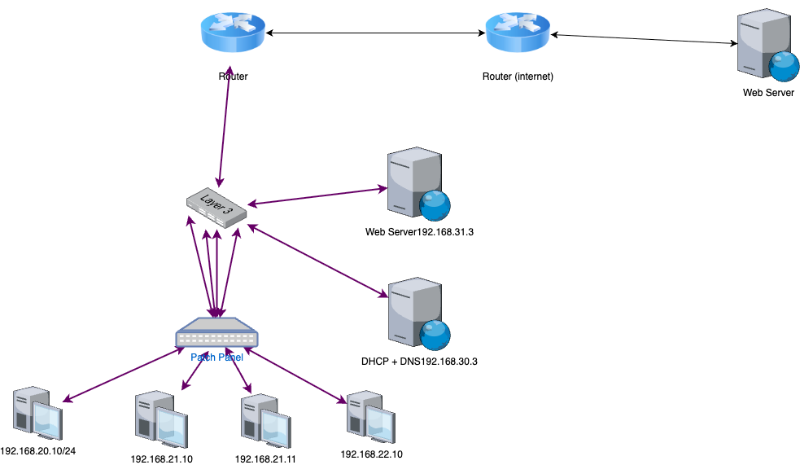

# CISCO CT – Architecture réseau d’entreprise

## Objectif du projet
Ce projet a pour objectif de concevoir et de mettre en œuvre une architecture réseau d’entreprise en utilisant des équipements Cisco.  
Il vise à reproduire une infrastructure réaliste intégrant des postes clients, des serveurs internes et un accès à Internet, tout en respectant les bonnes pratiques de conception et d’exploitation des réseaux informatiques.

---

## Structure du projet
Le projet est organisé de manière cohérente afin de faciliter la compréhension, la maintenance et l’exploitation de l’infrastructure :

- `docs/diagrams/` : schémas de la topologie réseau
- `topology/routers/` : configurations des routeurs
- `topology/switch/` : configurations des commutateurs
- `scripts/` : scripts d’initialisation et d’automatisation

Chaque dossier correspond à un rôle précis au sein de l’architecture réseau.

---

## Architecture réseau
L’architecture repose sur une organisation hiérarchisée du réseau comprenant :

- un routeur assurant l’accès à Internet
- un équipement de niveau 3 pour le routage interne
- des commutateurs pour la distribution du réseau
- des postes clients et des serveurs internes

Schéma de la topologie réseau :

Cette organisation permet une séparation claire des rôles entre :
- l’accès Internet
- le réseau local
- les services internes (DNS, DHCP, Web)

---

## Mise en œuvre technique

### Interconnexion des équipements
Les équipements réseau (routeurs et commutateurs) sont interconnectés afin d’assurer la circulation du trafic entre :
- les postes clients
- les serveurs internes
- le réseau Internet

Les liaisons sont configurées de manière cohérente afin de garantir la connectivité et la fiabilité des échanges au sein de l’infrastructure.

### Services réseau
Les services suivants sont déployés et exploités :
- un service DHCP pour l’attribution automatique des adresses IP
- un service DNS pour la résolution de noms
- un serveur Web accessible depuis le réseau interne

Les postes clients sont configurés pour utiliser correctement ces services réseau.

### Adressage IP et routage
L’infrastructure est découpée en plusieurs sous-réseaux IP afin de structurer le réseau.  
Le routage entre les différents réseaux est configuré pour permettre la communication interne ainsi que l’accès au réseau Internet.

---

## Compétences mobilisées (BTS SIO – Option SISR)

- Concevoir une architecture réseau structurée et cohérente  
  (Bloc 1 : Support et mise à disposition de services informatiques)

- Interconnecter et configurer des équipements réseau  
  (Bloc 2 : Administration des systèmes et des réseaux)

- Déployer et exploiter des services réseau essentiels (DNS, DHCP, Web)  
  (Bloc 2 : Administration des systèmes et des réseaux)

- Mettre en œuvre l’adressage IP et le routage  
  (Bloc 2 : Administration des systèmes et des réseaux)

Ce projet démontre la capacité à concevoir, configurer et exploiter une infrastructure réseau répondant aux besoins d’un système d’information d’entreprise, conformément aux attendus du BTS SIO option SISR.
