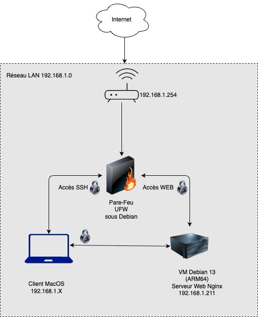

# Sécurisation d’un serveur Web Nginx sous Linux

## Objectif du projet
Ce projet a pour objectif d’installer, configurer et sécuriser un serveur Web sous Linux dans un contexte proche d’un environnement professionnel.  
Il vise à appliquer les bonnes pratiques d’administration système et réseau afin de déployer un service Web fonctionnel, accessible et sécurisé.

Le projet met l’accent sur la sécurisation des accès, la maîtrise des services exposés et la documentation des actions réalisées.

---

## Environnement technique
L’environnement technique utilisé pour ce projet est le suivant :

- Système d’exploitation : Debian GNU/Linux 13
- Architecture : ARM64 (Apple Silicon)
- Hyperviseur : VMware Fusion
- Serveur Web : Nginx
- Accès distant : OpenSSH
- Pare-feu : UFW
- Poste client : macOS
- Réseau : LAN 192.168.1.0/24

---

## Architecture de l’infrastructure
L’infrastructure repose sur une architecture simple et fonctionnelle comprenant :

- une machine virtuelle Debian 13 hébergeant le serveur Web
- un poste client macOS utilisé pour l’administration et les tests
- un réseau local (LAN)
- un accès SSH filtré
- un accès Web HTTP

Schéma de l’architecture réseau :

Cette architecture permet de tester et valider le déploiement d’un service Web sécurisé dans un environnement contrôlé.

---

## Mise en œuvre technique

### Installation et configuration du système
Debian GNU/Linux 13 est installé sans interface graphique afin de limiter la surface d’attaque et de privilégier une administration en ligne de commande.  
Le réseau est configuré avec une adresse IP statique afin de garantir la stabilité du service.

Un utilisateur administrateur disposant des droits sudo est créé pour l’administration du système.

### Sécurisation des accès
L’accès distant au serveur est assuré via SSH.  
La configuration est adaptée afin de limiter les risques d’accès non autorisés.

Un pare-feu UFW est installé et configuré pour :
- autoriser uniquement les ports nécessaires (SSH et HTTP)
- bloquer les connexions non autorisées
- renforcer la sécurité globale du serveur

### Déploiement du service Web
Le serveur Web Nginx est installé et configuré afin de fournir un service HTTP fonctionnel.  
Le service est activé au démarrage du système et testé depuis le réseau local.

### Tests et validation
Les tests suivants sont réalisés afin de valider le bon fonctionnement et la sécurité de l’infrastructure :

- test de connectivité réseau
- test d’accès SSH depuis le réseau local
- vérification du filtrage des accès SSH
- test d’accès HTTP au serveur Web
- vérification de l’état des services et du pare-feu

---

## Compétences mobilisées (BTS SIO – Option SISR)

- Installer, tester et déployer une solution d’infrastructure  
  (Bloc 1 : Support et mise à disposition de services informatiques)

- Exploiter, administrer et maintenir un système Linux  
  (Bloc 1 : Support et mise à disposition de services informatiques)

- Configurer et administrer les équipements et services réseau  
  (Bloc 2 : Administration des systèmes et des réseaux)

- Sécuriser les accès et les services exposés  
  (Bloc 2 : Administration des systèmes et des réseaux)

- Mettre en œuvre et exploiter un service réseau (serveur Web)  
  (Bloc 3 : Exploitation des services)

Ce projet démontre la capacité à administrer un système Linux, à sécuriser un service exposé et à justifier les choix techniques réalisés, conformément aux attendus du BTS SIO option SISR.

---

## Documentation
Une documentation technique complète accompagne ce projet et comprend :
- l’installation du système Debian 13
- la configuration réseau
- la sécurisation de l’accès SSH
- la configuration du pare-feu UFW
- l’installation et les tests du serveur Web Nginx
- les captures d’écran justifiant chaque étape

---

## Améliorations possibles
Plusieurs améliorations peuvent être envisagées afin de renforcer la sécurité et l’exploitation du serveur :

- mise en place du HTTPS (TLS)
- authentification SSH par clé
- désactivation de la connexion SSH du compte root
- déploiement de Fail2Ban
- mise en place d’une solution de supervision
- journalisation avancée des accès et des services

---

Rafael GAVERIAUX  
BTS SIO – Option SISR
